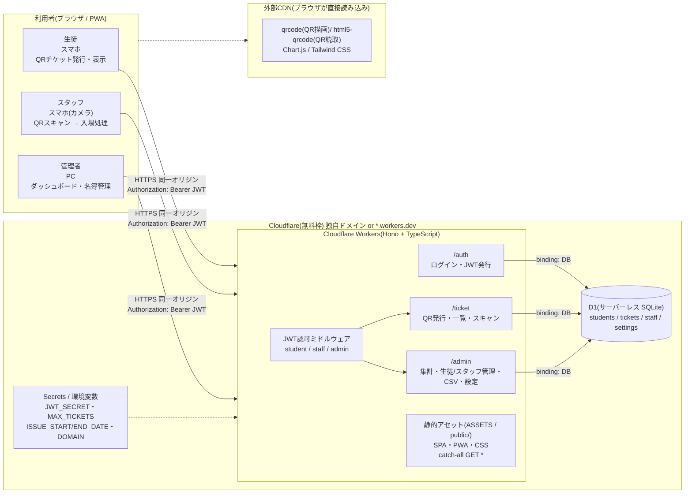

# MONpass システム構成図(Mermaid)

Zenn / Qiita / GitHub ではこのコードブロックをそのまま貼れば図として表示される。
画像版は `architecture.png`(2倍解像度)/ `architecture.svg`。

```mermaid
flowchart LR
    subgraph Users["利用者(ブラウザ / PWA)"]
        Student["生徒<br/>スマホ<br/>QRチケット発行・表示"]
        Staff["スタッフ<br/>スマホ(カメラ)<br/>QRスキャン → 入場処理"]
        Admin["管理者<br/>PC<br/>ダッシュボード・名簿管理"]
    end

    subgraph CF["Cloudflare(無料枠)  独自ドメイン or *.workers.dev"]
        subgraph Worker["Cloudflare Workers(Hono + TypeScript)"]
            MW["JWT認可ミドルウェア<br/>student / staff / admin"]
            Auth["/auth<br/>ログイン・JWT発行"]
            Ticket["/ticket<br/>QR発行・一覧・スキャン"]
            AdminAPI["/admin<br/>集計・生徒/スタッフ管理・CSV・設定"]
            Assets["静的アセット(ASSETS / public/)<br/>SPA・PWA・CSS<br/>catch-all GET *"]
        end
        D1[("D1(サーバーレス SQLite)<br/>students / tickets / staff / settings")]
        Secrets["Secrets / 環境変数<br/>JWT_SECRET・MAX_TICKETS<br/>ISSUE_START/END_DATE・DOMAIN"]
    end

    subgraph CDN["外部CDN(ブラウザが直接読み込み)"]
        Libs["qrcode(QR描画)/ html5-qrcode(QR読取)<br/>Chart.js / Tailwind CSS"]
    end

    Student & Staff & Admin -- "HTTPS 同一オリジン<br/>Authorization: Bearer JWT" --> Worker
    MW --> Ticket & AdminAPI
    Auth & Ticket & AdminAPI -- "binding: DB" --> D1
    Secrets -.-> Worker
    Users -.-> CDN
```
